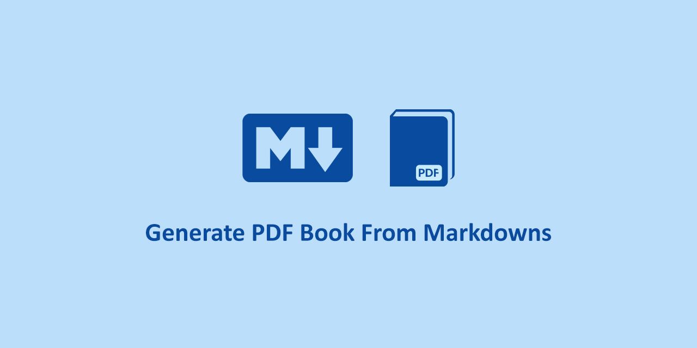

# mdpdfbook

This is a toolkit that generates pdf books from multiple `*.md` files or [mdBook](https://github.com/rust-lang/mdBook) based structure.

### How To Use?

-   Download `mdpdfbook.exe` from the `Releases` section.
-   Run the toolkit and Enter the directory path containing `SUMMARY.md` or other `*.md` files.
-   Press `Enter` to start operation.
-   The output file with the name `mdpdfbook-output.pdf` will be generated in the same directory.

If you want to generate pdf books from [mdBook](https://github.com/rust-lang/mdBook) based structure, You must enter the directory path containing the `SUMMARY.md` file in the root, otherwise enter the directory path containing multiple `*.md` files. No matter whether the markdown files are in the root or sub-folders, it merges all of them in order.

## Author

**Rabist** - view on [LinkedIn](https://www.linkedin.com/in/rabist)

## License

Licensed under [MIT](LICENSE).
